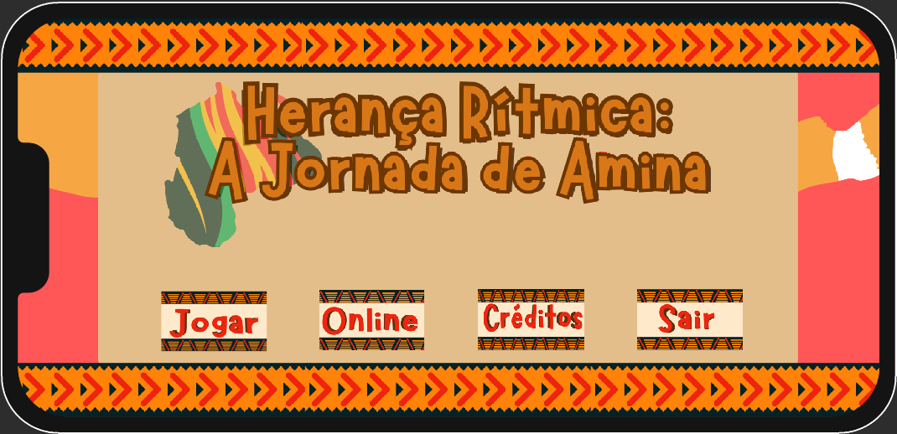
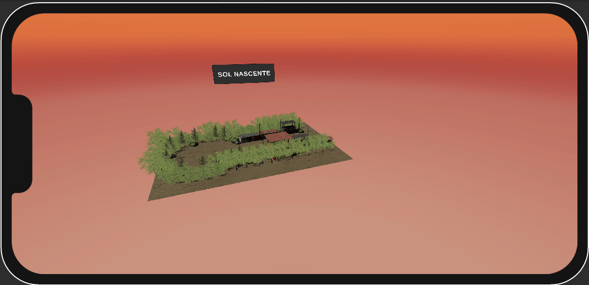
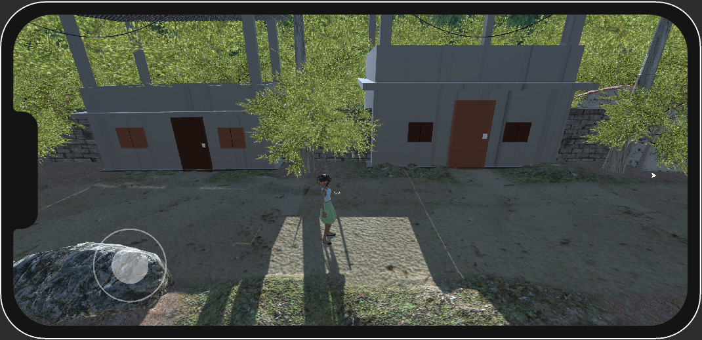
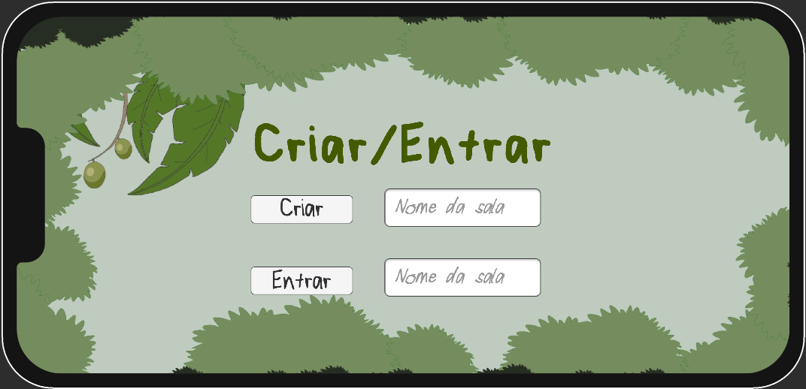
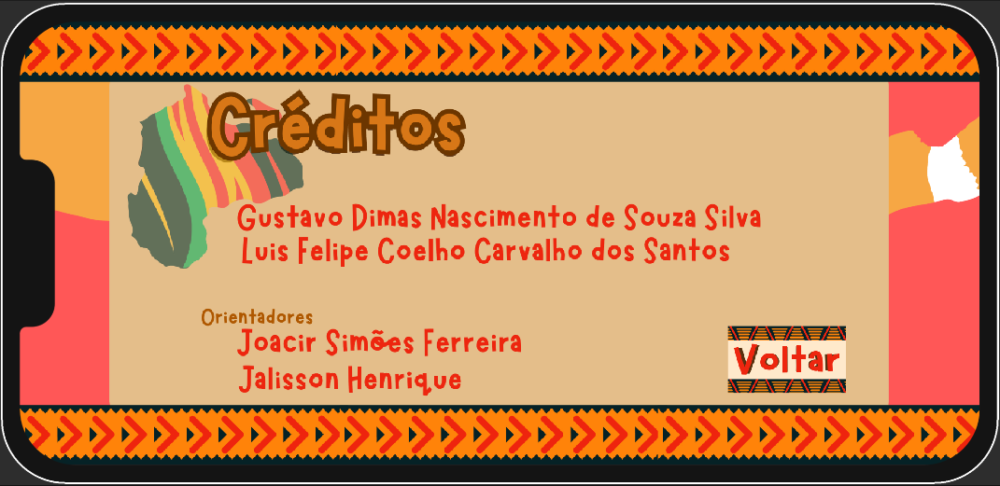

# Herança Ritmica: A Jornada de Amina

Em Herança Rítmica: A Jornada de Amina, Amina, uma jovem inexperiente, herda a liderança do Quilombo Muitarabá após a morte repentina de sua mãe. Determinada a unir sua comunidade, ela parte em uma jornada para aprender as tradições musicais únicas de quilombos vizinhos. Cada encontro a fortalece, permitindo-lhe criar sua própria manifestação musical e liderar com sabedoria. Explore cultura, resiliência e ritmo nesta emocionante aventura.

## Objetivo do desenvolvimento do jogo

“Herança Rítmica: A Jornada de Amina” é um jogo que destaca a **diversidade e as relações étnico-raciais**, inspirado pelo **Quilombo Quingoma** *[Instagram do Quingoma](https://www.instagram.com/quingomaquilombo/)*. O jogo coloca o jogador na pele de Amina, uma jovem líder que herda a responsabilidade de unir sua comunidade após a morte repentina de sua mãe.

## Imagens do jogo

- **Menu inicial**
  

- **Mapa dos Quilombos**
  - Apartamento da vítima, onde ocorreu o assassinato.
  

- **Primeiro Quilombo: "Quingoma"**
  - Dois velhinhos, moradores do prédio estão ao lado de fora, o jogador pode interagir com eles.

- **Desafios Musicais**
  - O jogador está na cidade e pode entrar em determinados locais.

- **Outro Quilombo: "Sol Nascente"**
  - Um dos puzzles que o jogador precisa resolver para adquirir informações.

- **Modo Online: Competição no Desafio Musical**
  - Um dos locais em que o jogador pode encontrar pistas.

- **Créditos**
  - Todos os desenvolvedores e orientadores do projeto.

## Tecnologias utilizadas

- **Unity (Game Engine)**
- **Aseprite (Software de Pixel Art)**